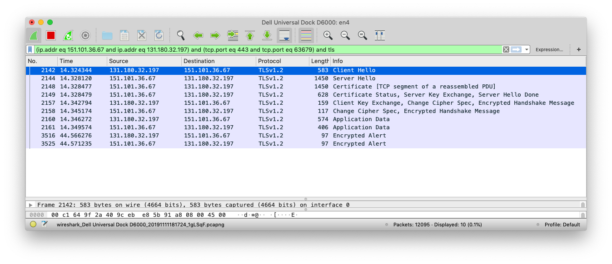
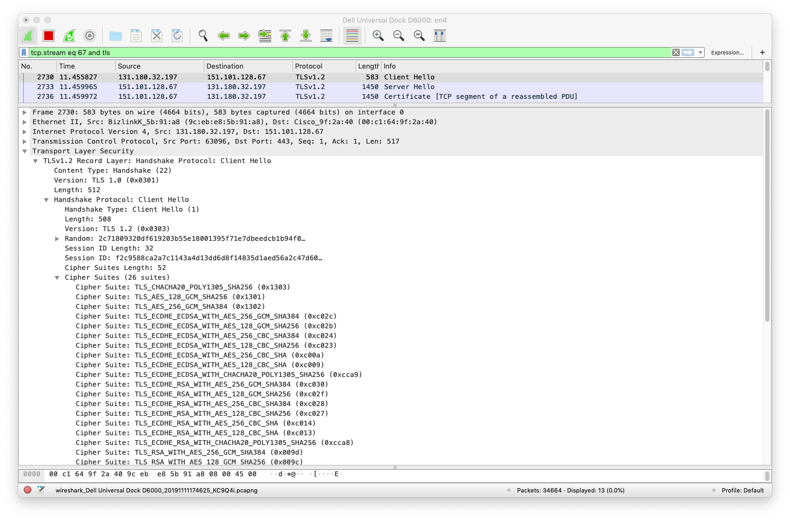
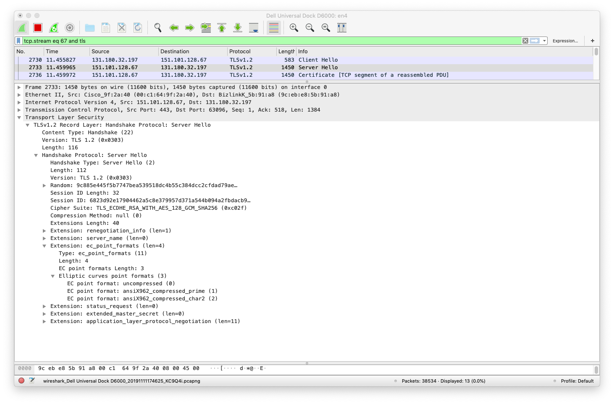
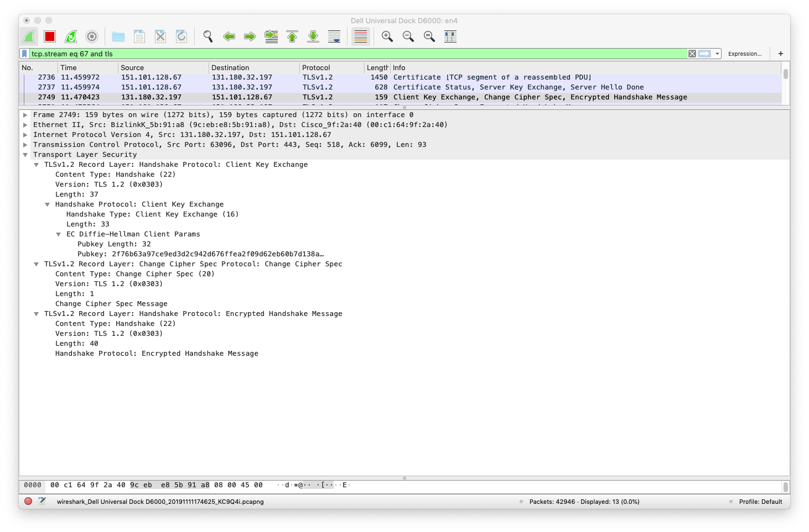
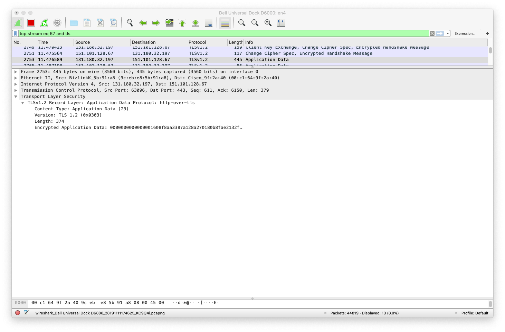

# The Pan-European Quantum Internet Hackathon

On 5 and 6 November 2019 I ([Bruno Rijsman](https://www.linkedin.com/in/brunorijsman/)) took part in the [Pan-European Quantum Internet Hackathon](https://labs.ripe.net/Members/ulka_athale_1/take-part-in-pan-european-quantum-internet-hackathon) that was orgnaized by the [RIPE labs](https://labs.ripe.net/).

Participants from six geographically distributed locations (Delft, Dublin, Geneva, Padua, Paris, and Sarajevo) formed teams and worked on various projects related to the [Quantum Internet](https://qutech.nl/wp-content/uploads/2018/10/Quantum-internet-A-vision.pdf).

I joined in Delft where the hackathon was hosted by [QuTech](https://qutech.nl/), a world-leading quantum technology research and development office within the [Delft University of Technology](https://www.tudelft.nl/).

# The OpenSSL Integration Challenge

In Delft, I joined a team working on one of the challenges suggested by the organizers. It was called the [_OpenSSL Integration Challenge_](https://github.com/PEQI19/PEQI-OpenSSL) and its goal was to enhance the [OpenSSL](https://www.openssl.org/) library with support for [Quantum Key Distribution (QKD)](https://en.wikipedia.org/wiki/Quantum_key_distribution) as the key agreement protocol.

The open source OpenSSL library is widely used to provide security on the Internet. One of the main functions of the OpenSSL library is to implement the [Transport Layer Security (TLS)](https://en.wikipedia.org/wiki/Transport_Layer_Security) protocol, which forms the basis for the [Secure Hypertext Transfer Protocol (HTTPS)](https://en.wikipedia.org/wiki/HTTPS), which in turn enables secure and private browsing on the Internet.

The name OpenSSL comes from the Secure Sockets Layer (SSL) protocol, a now outdated predecessor for the TLS protocol.

The TLS protocol performs multiple functions, including:

 1. _Authentication_: TLS validates that the website that you are connected to is really the website that it claims to be and not some malicious imposter (e.g. a fake website that looks just like your real bank website but that steals your username and password).

 2. _Confidentiality_: TLS encrypts the traffic between your browser and the website so that it cannot be intercepted by some malicious snooper in the middle (e.g. someone who is trying to steal your credit card information).

 3. _Integrity_: TLS makes sure that the traffic between your browser and the website is not modified by some malicious attacker in the middle (e.g. to change the account number in a bank transfer).

For the encryption part TLS uses so-called [symmetric encryption algorithms](https://en.wikipedia.org/wiki/Symmetric-key_algorithm), where the sender and the receiver use the _same_ key to encrypt and decrypt the traffic. One example of such a symmetric encryption algorithm is the [Advanced Encryption Standard (AES)](https://en.wikipedia.org/wiki/Advanced_Encryption_Standard).

# The Key Agreement Problem

Using symmetric encryption introduces a problem: how can the two ends of the connection (for example the browser in your home and the website in some data center on the other side of the world) agree on the shared key that is used to encrypt and decrypt the traffic? This is called the _key agreement problem_.

One method is the agree on the keys to be used in advance, before the communication starts, and to share these keys using some secure out-of-band mechanism. This approach is called using [Pre-Shared Keys (PSK)](https://en.wikipedia.org/wiki/Pre-shared_key). Imagine a spy and her handler physically exchanging papers with keys before the spy leaves to infiltrate the enemy. This is clearly not feasible or the Internet: a website cannot possibly have a set of pre-shared keys for every browser that could potentially visit the website.

Another method uses a very special kind of encryption, called asymmetric encryption or more commonly [public key cryptography](https://en.wikipedia.org/wiki/Public-key_cryptography). In this approach, there is a pair of keys: the so-called public key and the so-called private key:

 * When the browser sends traffic to the website, the browser encrypts the traffic with the public key, and the website decrypts the traffic with the private key.

 * In the other direction, when the website sends traffic to the browser, the website encrypts the traffic with the private key, and the browser decrypts the traffic with the public key.

 The public-private key pair has some very special properties:

  * If you encrypt something with the public key, it can only be decrypted with the private key (and not with the public key).

  * Vice versa, if you encrypt something with the private key, it can only be decrypted with the public key (and not with the private key).

  * If you know the public key, it is infeasible for a classical computer to determine the corresponding private key (a quantum computer may be able to do it, but that is not the topic of this challenge).

Because of these special properties, public-key cryptography solves the key distribution problem. A website can simply publish its public key but keep its private key secret (hence the names public and private key):

 * The browser can use the published public key to encrypt traffic that is sent to the website. Only the real website will be able to decrypt the traffic because only the real website knows the corresponding private key.

 * The browser can use the published public key to decrypt traffic that is received from the website. It can be sure that only the real website could have encrypted the traffic because only the real website knows the corresponding private key.

There are some additional technicalities that allow the browser to verify that a published public key is actually owned by the website that claims to have published it. This involves concepts such as [public key certificates](https://en.wikipedia.org/wiki/Public_key_certificate), [Certificate Authorities (CA)](https://en.wikipedia.org/wiki/Certificate_authority), [digital signatures](https://en.wikipedia.org/wiki/Digital_signature) etc. that are beyond the scope of this blog.
 
It sounds like public key encryption solves our key distribution problem, and indeed it does. Unfortunately, there is another problem: public key encryption is too slow to encrypt large volumes of traffic and still maintain decent throughput.

# Diffie-Hellman To The Rescue

It turns out that there is a way for two communicating parties to dynamically agree on a new symmetric encryption key for each communication session.

The browser and the website and exchange a series of messages, following a pre-determined protocol, and at the end of that message exchange, the browser and the website will have agreed on a so-called _shared secret_ that is only known to the browser and to the website and not to anyone else. The browser and the website can use this shared secret as the symmetric encryption key.

The amazing thing is that this statement ("the shared secret is only know to the browser and to the website and not to anyone else") is true _even_ if:

 (a) the key agreement protocol messages are sent in the clear (i.e. not encrypted), and

 (b) some malicious attacker is wiretapping the connection and observing all the messages that are exchanged during the key agreement protocol.

When I first read about this it blew my mind. Think about it: two random strangers can meet for the first time. They talk a little bit, and at the end of the conversation they both agree on some secret number. I am standing right next to them, and I can hear everything they are saying, but I cannot figure out what the secret number is. And these are random strangers who have never met before and how don't know anything about each other (so they can't say "the secret number is my birth year" for example). How is that even possible?

One widely used algorithm for dynamically agreeing on a shared secret is called the [Diffie-Hellman (DH) algorithm](https://en.wikipedia.org/wiki/Diffie%E2%80%93Hellman_key_exchange). The mathematical details of how it works are surprisingly simple (see below for details).

There are actually a number of variations on the Diffie-Hellman algorithm:

 * There a variation called [Elliptic Curve Diffie-Hellman (ECDH)](https://en.wikipedia.org/wiki/Elliptic-curve_Diffie%E2%80%93Hellman) that uses different math and is faster than DH.

 * Both DH and ECDH have a so-called _ephemeral_ variation (DHE and ECDHE) that uses different shared secret (as opposed to a secret but fixed one) for each communication session. This provides [Perfect Forward Secrecy (PFS)](https://en.wikipedia.org/wiki/Forward_secrecy): if the shared secret is ever compromised, only the one communication session that used that key can be decoded, and not any future communication sessions.

When your browser connects to a secure website, in most cases some variation of Diffie-Hellman (usually ECDHE) is used to implement key agreement. And in many cases, the OpenSSL library is used to implement Diffie-Hellman.

# The Diffie-Hellman Algorithm Details

The basic Diffie-Hellman algorthm (as opposed to the eliptic curve Diffie-Hellman algorithm) works as follows.

First you have to understand the concept of modular arithmetic. In _modulo N_ math, there is only a finite set of numbers from zero to N-1. When you add one number to another number, and the result is greater or equal to N, then the result "rolls over".

For example, in _modulo 7_ there are only 7 numbers, namely 0 through 6:

<pre>
    +---+---+---+---+---+---+---+
    | 0 | 1 | 2 | 3 | 4 | 5 | 6 |
    +---+---+---+---+---+---+---+
</pre>

If you start with the number 3 and you add 2, the result is 5:

<pre>
                    +1  +2
                   +-+ +-+
                   | | | |  
                   | v | v 
    +---+---+---+---+---+---+---+
    | 0 | 1 | 2 | 3 | 4 | 5 | 6 |
    +---+---+---+---+---+---+---+

    (3 + 2) mod 7 = 5
</pre>

But if you start with the number 3 and you add 5, the result is 1 (we "rolled over"):

<pre>
    +4  +5          +1  +2  +3    
 +---+ +-+         +-+ +-+ +-+ +---+
 |   | | |         | | | | | | |   |
 |   v | v         | v | v | v |   |
 |  +---+---+---+---+---+---+---+  |
 |  | 0 | 1 | 2 | 3 | 4 | 5 | 6 |  |
 |  +---+---+---+---+---+---+---+  |
 |                                 |
 +---------------------------------+

    (3 + 5) mod 7 = 1
</pre>

Once we have defined modular addition, it is straightforward to define modular subtraction (the inverse of addition), multiplication (repeated addition), division (the inverse of multiplication), etc. 

Now that we are clear on modular math, we can explain the Diffie-Hellman algorithm:

 * Step 1: The server and the client agree a-priori on two numbers:

   * A large prime number **p**.

   * A generator number **g** where 1 <= g <= p.

   * There are some additional technical requirements on the values of p and g that we won't discuss in detail for the sake of simplicity.

   * The numbers p and g are public, i.e. they do not need to be secret. In fact, good values for p and g that meet all the technical requirements are published in standard documents such as [RFC3526](https://www.ietf.org/rfc/rfc3526.txt).

   * The TLS protocol includes steps to negotiate which variation of Diffie-Hellman is being used (DH, ECDH, DHE, ECDHE) and what set of parameters (p and g in the case of DH) are being used.

 * Step 2: The server and client each pick a different **secret_key**:

   * The secret_key must be in the range 1 <= secret_key < p

   * Let's call the secret key chosen by the server **server_secret_key** and the secret key chosen by the client **client_secret_key**.

   * The secret keys are, as the name implies, secret: they must never be sent on the wire or otherwise publicly exposed.

 * Step 3: Both the server and the client derive a **public_key** from the combination of the public parameters p and g as well as their own private_key:

  * The private_key is computed as follows (where ^ means exponentation):

    public_key = (g ^ private_key) mod p

  * Thus:

    **server_public_key** = (g ^ server_private_key) mod p

    **client_public_key** = (g ^ client_private_key) mod p

* Each side sends its computed public_key to the other side:

  * The server sends the server_public_key to the client

  * The client sends the client_public_key to the server

  * Note that a malicious attacker can observe this messages. Thus the malicious attacker knows the values p, g, server_public_key, and client_public_key. But the malicious attacker does not know the value server_private_key or client_private_key because those values were never sent on the wire.

* Each each side receives the peer's public_key it computes a **shared_secret** value.

  * The shared_secret is computed as follows:

    shared_secret = (peer_public_key ^ own_private_key) mod p

 * Thus:

   **server_shared_secret** = (client_public_key ^ server_private_key) mod p

   **client_shared_secret** = (server_public_key ^ client_private_key) mod p

* It is not difficult to see that the server and the client will arrive at the same shared secret value:

   server_shared_secret = 
   
   (client_public_key ^ server_private_key) mod p =

   ( (g ^ client_private_key) mod p) ^ server_private_key ) mod p =

   ( (g ^ client_private_key) ^ server_private_key ) mod p =

   ( g ^ (client_private_key * server_private_key) ) mod p =

   ( g ^ (server_private_key * client_private_key) ) mod p =

   ( (g ^ server_private_key) ^ client_private_key ) mod p =

   ( (g ^ server_private_key) mod p) ^ client_private_key ) mod p =

   (server_public_key ^ client_private_key) mod p =

   client_shared_secret

 * Now that the client and the server have agreed on a shared_secret, this value is used as the symmetric key to encrypt the rest of the conversation.

# Diffie-Hellman In Action

Let's have a look at the Diffie-Hellman algorithm in action in the real world. I use a browser (Safari in this example) to visit a secure website ([https://www.google.com/](https://xkcd.com/) in this example). In this scenario, the browser acts as the TLS client, and the website acts as the TLS server. I use the [WireShark](https://www.wireshark.org/) protocol analyzer to capture and analyze the TLS traffic.

The following screenshot shows the TLS traffic between my browser and the Google website (I have filtered the traffic to show only a single TLS session).

TODO

Let's zoom in on some specific packets to see the details of the Diffie-Hellman exchange.

In the following screenshot we see the _TLS Client Hello_ message that the client sends to the server. It contains @@@.

In the following screenshot we see the _TLS Server Hello_ message that the server sends to the client. It contains @@@.

In the following screenshot we see the _TLS Client Key Exchange_ message that the client sends to the server. It contains @@@.

TODO

At this point, the client and the server have agreed

# Diffie-Hellman Can Be Broken By Quantum Computers

TODO

# Two Approaches To Fixing Key Agreement In The Post-Quantum Era

TODO

# The BB84 Quantum Key Distribution Protocol

TODO

# Quantum Key Distribution Devices

TODO

# The ETSI Quantum Key Distribution API

TODO

# The ETSI Quantum Key Distribution API

TODO

# Running OpenSSL On Top Of The ETSI QKD API

TODO

# OpenSSL Engines

TODO

# The Code For The OpenSSL Engine For QKD On Top Of The ETSI QKD API

TODO

# Running The OpenSSL Engine For QKD On Top Of The ETSI QKD API

TODO

# Credits

I want to thank the following organizations and people for making the hackathon possible:
 * [RIPE labs](https://labs.ripe.net/) for organizing the pan-European hackathon.
 * [Wojciech Kozlowski](https://www.linkedin.com/in/wojciech-kozlowski/), postdoctoral researcher at [QuTech](https://qutech.nl/) at the Technical University of Delft and main author of the [Architectural Principles of the Quantum Internet](https://datatracker.ietf.org/doc/draft-irtf-qirg-principles/) document that is being developed in the [Quantum Internet Research Group (QIRG)](https://datatracker.ietf.org/rg/qirg/about/) in the [Internet Research Task Force (IRTF)](https://irtf.org/). I want to thank him for his role in hosting the hackathon in Delft, coming up with the _OpenSSL Integration Challenge_, and for working with me on Quantum networking.
 * [Yvo Keuter](https://www.linkedin.com/in/yvo-keuter-6794932/) and [Tim Janssen](https://www.linkedin.com/in/timjanssen89/), both from [Visma Connect](https://vismaconnect.nl/en/), for being wonderful team members and working with me on the _OpenSSL Integration Challenge_.
