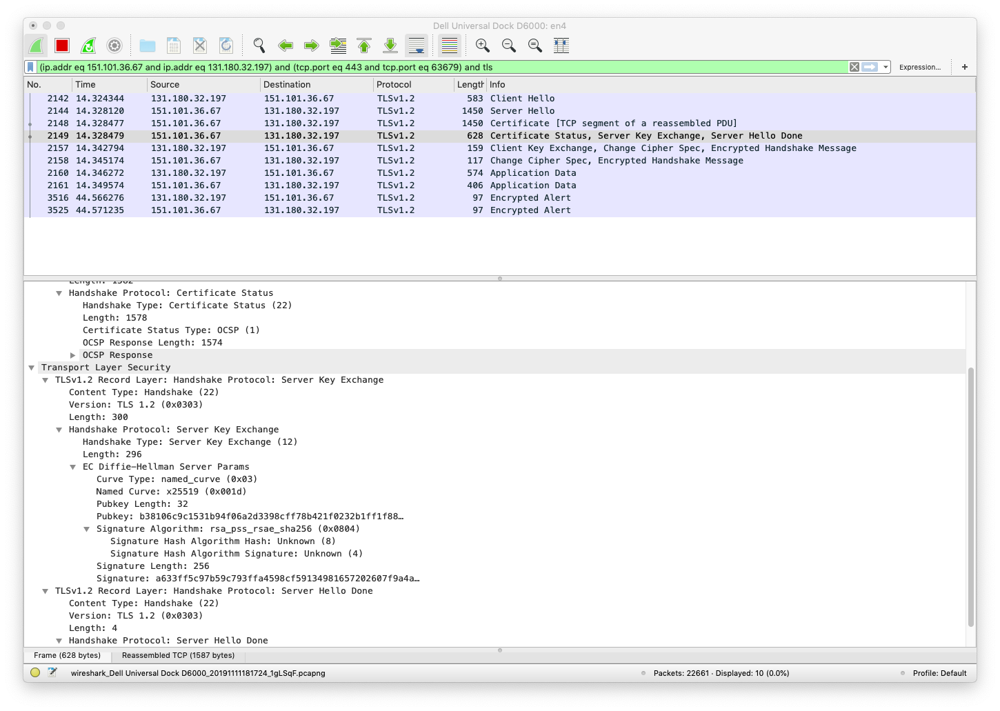
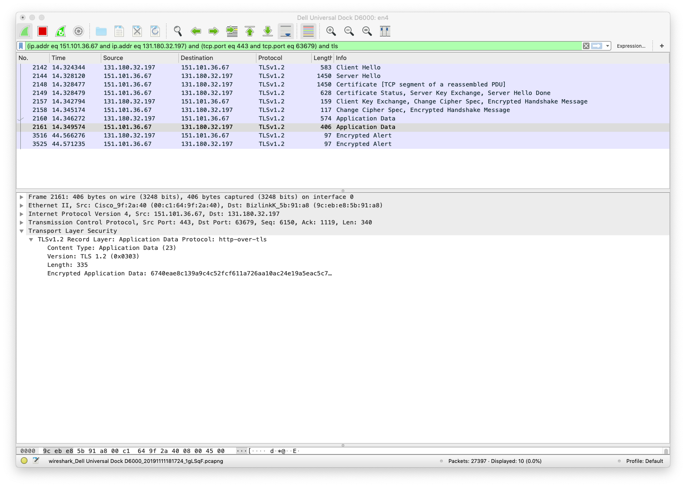

This is part 1 in a multi-part report describing how we implemented Quantum Key Distribution (QKD) in OpenSSL as part of the pan-European quantum Internet hackathon in Delft on 5 and 6 November 2019. See [the main page of this report](../README.md) for the other parts.

# Security in the classical Internet.

## Security challenges in the Internet: authentication, confidentiality, and integrity.

Imagine that you use your web browser to connect to your bank's website to transfer some money. Some of the main network security challenges in this transaction are:

 1. _Authentication_: You want to validate (i.e. make sure) that the website that you are connected to is really the bank's website and not some fake website that looks exactly like your bank's website but was created by a criminal to steal your username and password.
 
 2. _Confidentiality_: You want all the traffic between your browser and the bank's website to be encrypted so that it cannot be seen by some malicious snooper in the middle. For example you don't want a thief who is on the same public Wifi to steal your username and password. Frankly, you don't even want your Internet service provider to know what terms you are searching for on Google.

 3. _Integrity_: You want to make sure that the traffic that is exchanged between the browser and the website is not modified by some malicious actor in the middle. For example, you don't want that thief who is on the same public Wifi to change the bank account in the transfer to her own account.

These challenges don't only apply to browsing on the Internet, but also to other applications such as e-mail, messaging, file transfers, machine-to-machine communications, etc.

There are other security challenges such as [non-repudiation](https://en.wikipedia.org/wiki/Non-repudiation) or [anonymity](https://en.wikipedia.org/wiki/Anonymity#Anonymity_on_the_Internet), but in this report we focus on the three that we listed.
 
## The Transport Layer Security (TLS) protocol.

The [Transport Layer Security (TLS)](https://en.wikipedia.org/wiki/Transport_Layer_Security) protocol is one of the most widely used protocols on the Internet for providing authentication, confidentiality, integrity, and other security functions.

TLS was standardized by the [Internet Engineering Task Force (IETF)](https://www.ietf.org/), which is the main standardization organization for Internet protocols.

There are multiple versions of TLS, each described in its own standards document which is called a [Request For Comment (RFC)](https://en.wikipedia.org/wiki/Request_for_Comments) in IETF jargon:
 * TLS 1.0 is described in [RFC 2246](https://tools.ietf.org/pdf/rfc2246.pdf)
 * TLS 1.1 is described in [RFC 4346](https://tools.ietf.org/pdf/rfc4346.pdf)
 * TLS 1.2 is described in [RFC 5246](https://tools.ietf.org/pdf/rfc5246.pdf)
 * TLS 1.3 is the most recent version of TLS and is described in [RFC 8446](https://tools.ietf.org/pdf/rfc8446.pdf)

The predecessor for TLS was the [Secure Sockets Layer (SSL)](https://tools.ietf.org/html/rfc6101) protocol, which is now considered obsolete. However, many people still use the older term SSL when they are actually referring to TLS. For example, one of the main open source implementations of TLS is still called [OpenSSL](https://www.openssl.org/).

## Symmetric versus asymmetric encryption.

One of the main functions of the TLS protocols is to encrypt all traffic between the two communicating end-points.

Generally speaking, there are two types of encryption:
 
 * _Symmetric encryption_.
 * _Asymmetric encryption_ also known as _public key encryption_ or _private-public key encryption_.

#### Symmetric encryption.

In symmetric encryption the two communicating end-points use one and the same key.

The sender encrypts the traffic with a particular key. The receiver decrypts the traffic with that same key. The same key is used in both directions: for client-to-server and server-to-client traffic.

The key must remain secret. Only the two end-points are allowed to know the key. If some malicious attacker also discovers the key, she will be able to tap and decrypt the traffic as it flows from sender to receiver. She can even decrypt the traffic, change it, and re-encrypt the changed traffic, without the two end-points discovering that the message was tampered with.

There are several algorithms (also known as ciphers) for symmetric encryption, such as for example the [Advanced Encryption Standard (AES)](https://en.wikipedia.org/wiki/Advanced_Encryption_Standard), the [International Data Encryption Algorithm (IDEA)](https://en.wikipedia.org/wiki/International_Data_Encryption_Algorithm), and [Blowfish](https://en.wikipedia.org/wiki/Blowfish_(cipher)).
 
Each algorithm are multiple variations (so-called modes) and supports multiple key sizes (for example 128 bits, 192 bits, 256 bits etc.)

Symmetric encryption is very fast and can be implemented in hardware. As a random example, the [Juniper PTX10K-LC1105 line card](https://www.juniper.net/documentation/en_US/release-independent/junos/topics/reference/specifications/line-card-ptx10k-lc1105.html) has 30 MacSec Ethernet ports, where each port can do 100 Gbps AES256 encryption at wire-speed, for a total of 3 Tbps of encryption and decryption per card.

#### Asymmetric encryption.

In asymmetric encryption the two communicating end-points use different keys:

 * Let's call the end-points S (for Sender) and R (for Receiver). We will now describe how S can send a message to R. A similar protocol can be used for sending a message from R to S (just reverse everything in the following explanation).

 * R creates a pair of keys: one key is called the private key and the other key is called the public key. Note that every receiver needs its own private-public key pair.

 * If a message is encrypted with the public key, it can only be decrypted with the private key. This asymmetry is a consequence of the mathematical details of how the protocol is designed, using so-called one-way functions that can easily be computed but that are infeasible to inverse.

 * R publishes its public key, but keeps it private key secret. Everyone is allowed to know the public key, even malicious attackers. No-one is allowed to know the private key, not even S.

 * When S sends a message to R, it encrypts the message with the public key. Only R will be able to decrypt the message, because only R knows the private key. Some malicious attacker can see the encrypted message and knows the public key, but she cannot decrypt the message because she does not have the private key.

For obvious reasons, asymmetric encryption is also known as public key encryption or private-public key encryption.

The best known asymmetric encryption algorithm is called [Rivest Shamir Adleman (RSA)](https://en.wikipedia.org/wiki/RSA_(cryptosystem)) after the names of inventors.

The problem with asymmetric encryption is that it is slow. Specifically, it is not fast enough for line rate encryption of large volumes of traffic. For that reason, TLS always uses symmetric encryption for encrypting and decrypting the application traffic.

Still, the same mathematical principles of asymmetric encryption are used to address some other problems in network security, including [key agreement](https://en.wikipedia.org/wiki/Key-agreement_protocol) and [secure signing](https://en.wikipedia.org/wiki/Digital_signature). We will discuss the former in more detail when we talk about the [key distribution problem](#the-key-distribution-problem) below.

#### The security of classical encryption.

As the power of classical computers increases over time and as new classical attack vectors are discovered on encryption algorithms, some protocols become obsolete over time because they are not considered to be secure anymore. Or at least, the required key sizes increase over time. For example, the [Data Encryption Standard (DES)](https://en.wikipedia.org/wiki/Data_Encryption_Standard) was widely used for many years but is not considered to be secure anymore and has been replaced by AES.

The security of asymmetric encryption protocols is based on the fact that it is infeasible to factor large numbers in to prime factors. At least, it is infeasible for classical computers to do the factorization. In the 1990s an efficient quantum algorithm was discovered that quantum computer to factor large numbers. As a result, most existing asymmetric encryption protocols are not secure if the adversary has access to a sufficiently large and reliable quantum computer (no such computer is known to exist at this time.) 

We will go into much more detail in [part 2 (Quantum computing breaks and fixes classical security)](quantum-computing-breaks-and-fixes-classical-security.md) of this report. We bring it up here to make an important point: only asymmetric encryption is known to be vulnerable to a quantum attack; as far as we know (but this is not formally proven) symmetric encryption is not vulnerable to quantum attack.

## The key distribution problem

We already mentioned that for performance reasons symmetric encryption (as opposed to asymmetric encryption) is used to encrypt high-speed traffic. TLS, for example, always uses symmetric encryption for application traffic.

Using symmetric encryption introduces a problem: how can the two end-points of the connection (for example the browser in your home and the website in some data center on the other side of the world) agree on the encryption key that is used to encrypt and decrypt the traffic? This is called the key distribution problem or the key agreement problem or the [key exchange problem](https://en.wikipedia.org/wiki/Key_exchange#The_key_exchange_problem).

One obvious method is to agree on the key to be used in advance, before the communication starts, and to share the key using some secure out-of-band mechanism. This approach is called using [Pre-Shared Keys (PSK)](https://en.wikipedia.org/wiki/Pre-shared_key). Imagine a spy and her handler physically exchanging [papers with keys (so-called one time pads)](https://en.wikipedia.org/wiki/One-time_pad#/media/File:NSA_DIANA_one_time_pad.tiff) before the spy leaves to infiltrate the enemy. This is clearly not feasible or the Internet: a website cannot possibly have a set of pre-shared keys for every browser that could potentially visit the website.

Another method for implementing key agreement is based on the same mathematical principles as asymmetric encryption.

The basic idea is very simple to understand:

 * Let say that S (Sender) and R (Receiver) want to agree on a symmetric key (the so-called session key) to use for a particular high-volume communication session.
 * S picks a random value as the session key.
 * S uses R's public key to encrypt the session key using RSA (an asymmetric encryption algorithm).
 * R uses its own private key to decrypt the session key.
 * Now S and R have agreed on a session key.

There are some additional technicalities that allow S to verify that the public key is actually owned by R. This involves concepts such as [public key certificates](https://en.wikipedia.org/wiki/Public_key_certificate), [Certificate Authorities (CA)](https://en.wikipedia.org/wiki/Certificate_authority), [digital signatures](https://en.wikipedia.org/wiki/Digital_signature) etc. that are beyond the scope of this report.
 
This above protocol is known as [RSA Key Transport](https://www.researchgate.net/figure/TLS-key-transport-with-RSA_fig1_234811497), but for various reasons this protocol is now deprecated.

The actual protocol that is used in the Internet today for key agreement is known as the [Diffie-Hellman protocol](https://en.wikipedia.org/wiki/Diffie%E2%80%93Hellman_key_exchange). It does not use asymmetric encryption such as RSA directly, but it is based on the same mathematical principles.

## The Diffie-Hellman key exchange protocol.

It turns out that there is a way for two communicating parties to dynamically agree on a new symmetric encryption key (the session key) for each communication session.

The browser and the website and exchange a series of messages, following a pre-determined protocol, and at the end of that message exchange, the browser and the website will have agreed on a so-called _shared secret_ that is only known to the browser and to the website and not to anyone else. The browser and the website can use this shared secret as the symmetric encryption key.

The amazing thing is that this statement ("the shared secret is only know to the browser and to the website and not to anyone else") is true _even_ if:

 (a) the key agreement protocol messages are sent in the clear (i.e. not encrypted), and
 (b) some malicious attacker is wiretapping the connection and observing all the messages that are exchanged during the key agreement protocol.

When I first read about this it blew my mind. Think about it: two random strangers can meet for the first time. They talk a little bit, and at the end of the conversation they both agree on some secret number. I am standing right next to them, and I can hear everything they are saying, but I cannot figure out what the secret number is. And these are random strangers who have never met before and how don't know anything about each other (so they can't say "the secret number is my birth year" for example). How is that even possible?

The most widely used algorithm for dynamically agreeing on a shared secret is called the [Diffie-Hellman (DH) algorithm](https://en.wikipedia.org/wiki/Diffie%E2%80%93Hellman_key_exchange). The mathematical details of how it works are surprisingly simple (see below for details).

There are actually a number of variations on the Diffie-Hellman algorithm:

 * There a variation called [Elliptic Curve Diffie-Hellman (ECDH)](https://en.wikipedia.org/wiki/Elliptic-curve_Diffie%E2%80%93Hellman) that uses different math and is faster than DH.

 * Both DH and ECDH have a so-called _ephemeral_ variation (DHE and ECDHE) that uses different shared secret (as opposed to a secret but fixed one) for each communication session. This provides [Perfect Forward Secrecy (PFS)](https://en.wikipedia.org/wiki/Forward_secrecy): if the shared secret is ever compromised, only the one communication session that used that key can be decoded, and not any future communication sessions.

When your browser connects to a secure website, in most cases some variation of Diffie-Hellman (usually ECDHE) is used to implement key agreement. And in many cases, the OpenSSL library is used to implement Diffie-Hellman.

## The Diffie-Hellman algorithm details.

The basic Diffie-Hellman algorithm (as opposed to the elliptic curve Diffie-Hellman algorithm ECDH) works as follows.

First you have to understand the concept of modular arithmetic. In _modulo N_ math, there is only a finite set of numbers from zero to N-1. When you add one number to another number, and the result is greater or equal to N, then the result "rolls over".

For example, in _modulo 7_ there are only 7 numbers, namely 0 through 6:

<pre>
    +---+---+---+---+---+---+---+
    | 0 | 1 | 2 | 3 | 4 | 5 | 6 |
    +---+---+---+---+---+---+---+
</pre>

If you start with the number 3 and you add 2, the result is 5:

<pre>
                    +1  +2
                   +-+ +-+
                   | | | |  
                   | v | v 
    +---+---+---+---+---+---+---+
    | 0 | 1 | 2 | 3 | 4 | 5 | 6 |
    +---+---+---+---+---+---+---+

    (3 + 2) mod 7 = 5
</pre>

But if you start with the number 3 and you add 5, the result is 1 (we "rolled over"):

<pre>
    +4  +5          +1  +2  +3    
 +---+ +-+         +-+ +-+ +-+ +---+
 |   | | |         | | | | | | |   |
 |   v | v         | v | v | v |   |
 |  +---+---+---+---+---+---+---+  |
 |  | 0 | 1 | 2 | 3 | 4 | 5 | 6 |  |
 |  +---+---+---+---+---+---+---+  |
 |                                 |
 +---------------------------------+

    (3 + 5) mod 7 = 1
</pre>

Once we have defined modular addition, it is straightforward to define modular subtraction (the inverse of addition), multiplication (repeated addition), division (the inverse of multiplication), etc. 

Now that we are clear on modular math, we can explain the Diffie-Hellman algorithm:

 * Step 1: The server and the client agree a-priori on two numbers:

   * A large prime number **p**.

   * A generator number **g** where 1 <= g <= p.

   * There are some additional technical requirements on the values of p and g that we won't discuss in detail for the sake of simplicity.

   * The numbers p and g are public, i.e. they do not need to be secret. In fact, good values for p and g that meet all the technical requirements are published in standard documents such as [RFC3526](https://www.ietf.org/rfc/rfc3526.txt).

   * The TLS protocol includes steps to negotiate which variation of Diffie-Hellman is being used (DH, ECDH, DHE, ECDHE) and what set of parameters (p and g in the case of DH) are being used.

 * Step 2: The server and client each pick a different **secret_key**:

   * The secret_key must be in the range 1 <= secret_key < p

   * Let's call the secret key chosen by the server **server_secret_key** and the secret key chosen by the client **client_secret_key**.

   * The secret keys are, as the name implies, secret: they must never be sent on the wire or otherwise publicly exposed.

 * Step 3: Both the server and the client derive a **public_key** from the combination of the public parameters p and g as well as their own private_key:

  * The private_key is computed as follows (where ^ means exponentation):

    public_key = (g ^ private_key) mod p

  * Thus:

    **server_public_key** = (g ^ server_private_key) mod p

    **client_public_key** = (g ^ client_private_key) mod p

* Each side sends its computed public_key to the other side:

  * The server sends the server_public_key to the client

  * The client sends the client_public_key to the server

  * Note that a malicious attacker can observe this messages. Thus the malicious attacker knows the values p, g, server_public_key, and client_public_key. But the malicious attacker does not know the value server_private_key or client_private_key because those values were never sent on the wire.

* Each each side receives the peer's public_key it computes a **shared_secret** value.

  * The shared_secret is computed as follows:

    shared_secret = (peer_public_key ^ own_private_key) mod p

 * Thus:

   **server_shared_secret** = (client_public_key ^ server_private_key) mod p

   **client_shared_secret** = (server_public_key ^ client_private_key) mod p

* It is not difficult to see that the server and the client will arrive at the same shared secret value:

   server_shared_secret = 
   
   (client_public_key ^ server_private_key) mod p =

   ( (g ^ client_private_key) mod p) ^ server_private_key ) mod p =

   ( (g ^ client_private_key) ^ server_private_key ) mod p =

   ( g ^ (client_private_key * server_private_key) ) mod p =

   ( g ^ (server_private_key * client_private_key) ) mod p =

   ( (g ^ server_private_key) ^ client_private_key ) mod p =

   ( (g ^ server_private_key) mod p) ^ client_private_key ) mod p =

   (server_public_key ^ client_private_key) mod p =

   client_shared_secret

 * Now that the client and the server have agreed on a shared_secret, this value is used as the symmetric key to encrypt the rest of the conversation.

## Example packet trace showing a Diffie-Hellman exchange.

Let's have a look at the Diffie-Hellman algorithm in action in the real world. I use a browser (Safari in this example) to visit a secure website ([https://www.google.com/](https://xkcd.com/) in this example). In this scenario, the browser acts as the TLS client, and the website acts as the TLS server. I use the [WireShark](https://www.wireshark.org/) protocol analyzer to capture and analyze the TLS traffic.

The following screenshot shows the TLS traffic between my browser and the Google website (I have filtered the traffic to show only a single TLS session).

In this case the client and server negotiate the use of Elliptic Curve Diffie-Hellman Ephemeral (ECDHE) whose parameters are a little bit different than the g and p of regular Diffie-Hellman, the the flow of the messages is the same.

We only show a subset of the exchanged TLS messages, namely the ones that illustrate how the Diffie-Hellman exhange works.

#### Session Overview

Let's zoom in on some specific packets to see the details of the Diffie-Hellman exchange.

#### TLS Client Hello

In the following screenshot we see the _TLS Client Hello_ message that the client sends to the server.

It contains a list, sorted in order of preference, of proposed _Cipher Suites_ that the client supports from which the server can choose. Each cipher suite proposed, amongst other things, a specific key exchange protocol such as for example Elliptic Curve Diffie Hellman-Ephemeral (ECDHE).

#### TLS Server Hello

In the following screenshot we see the _TLS Server Hello_ message that the server sends to the client.

It contains the _Cipher Suite_ that the server has chosen.

#### TLS Server Certificate Status

In the following screenshot we see the _TLS Certificate Status_ message that the server sends to the client.

The _Server Key Exchange_ field contains the public _Elliptic Curve (EC) Diffie-Hellman Parameters_ as well as the _Public Key_ chosen by the server.

#### TLS Server Client Key Exchange

In the following screenshot we see the _TLS Client Key Exchange_ message that the client sends to the server.

It contains the Diffie-Hellman _Public Key_ chosen by the client.

#### Encrypted Application Data

At this point both the server and the client have all the information that they need to each compute the shared secret (which never appears on the wire).

From here on out, both side use the shared secret to encrypt the application traffic.

First we see a message with encrypted application data from the client to the server. This actually contains the encrypted HTTP GET request (we know that, but we cannot see that in the encrypted packet).

Then we see a message with encrypted data going back from the server to the client. This actually contains the encrypted HTTP GET response (we know that, but we cannot see that in the encrypted packet).

## What is OpenSSL and how does it fit into the picture?

The open source OpenSSL library is widely used to provide security on the Internet. One of the main functions of the OpenSSL library is to implement the [Transport Layer Security (TLS)](https://en.wikipedia.org/wiki/Transport_Layer_Security) protocol, which forms the basis for the [Secure Hypertext Transfer Protocol (HTTPS)](https://en.wikipedia.org/wiki/HTTPS), which in turn enables secure and private browsing on the Internet.

The name OpenSSL comes from the Secure Sockets Layer (SSL) protocol, a now outdated predecessor for the TLS protocol.

